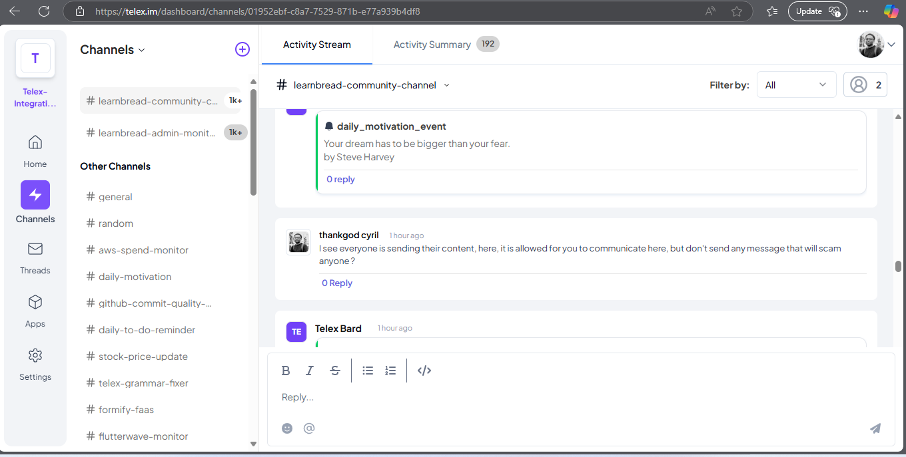
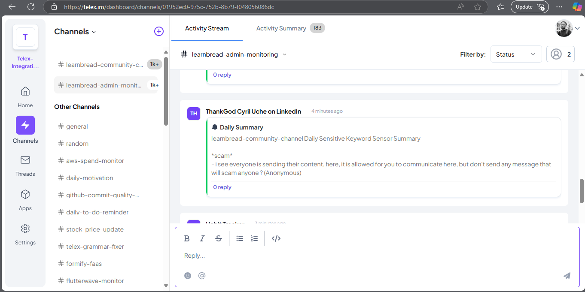

# A Telex integration

A Telex integration that monitors sensitive keywords from the learnbread-community-channel in Telex, and sends the summary to the learnbread-admin-channel on the Telex platform (telex.im) every 1 hour, for now the interval is every 1 minutes (because of the number of multiple chat dropping in the learnbread-community-channel).

**Author:** ThankGod Cyril Uche  
**GitHub Repository:** [telex-integration](https://github.com/telexintegrations/learnbread-telex-channel-monitoring)

---

## **Table of Contents**
1. [Project Overview](#project-overview)  
2. [Technologies Used](#technologies-used)  
3. [Installation Guide](#installation-guide)  
   - [Install Dependencies](#install-dependencies)  
   - [Set Up Environment File](#set-up-the-environment-file)  
   - [Generate Application Key](#generate-application-key)  
   - [Run Migrations](#run-migrations)  
4. [API Documentation](#api-documentation)  
   - [Endpoint: `GET /api/info`](#endpoint-get-apiinfo)  
   - [Endpoint: `GET /api/classify-number`](#endpoint-get-apiclassify-number)  
   - [Endpoint: `GET /api/json-data`](#endpoint-get-apijson-data)  
   - [Endpoint: `POST /api/telex/get-summary`](#endpoint-post-apitelexget-summary)  
   - [Endpoint: `POST /api/telex/get-message-from-channel`](#endpoint-post-apitelexget-message-from-channel)  
   - [Response Codes](#response-codes)  
5. [Running the Application](#running-the-application)  
6. [Contributing](#contributing)  
7. [License](#license)  
8. [Other Links](#other-links)  
9. [Screenshots](#screenshots)  

---

## **Project Overview**
This project is for HNG Backend Track

- **Email**: The email address used to register for the HNG12 Slack workspace.
- **Current Datetime**: The current UTC date and time in ISO 8601 format.
- **GitHub URL**: The URL of the project's codebase on GitHub.

The endpoint is publicly accessible and designed to provide basic information in a clean, JSON format.

---

## **Technologies Used**
- **Backend Framework**: [Laravel 11.x](https://laravel.com)
- **PHP**: Version 8.1 or higher
- **Composer**: Dependency Management
- **Database**: None required for this project (No database interaction in this task)
- **API Response Format**: JSON
- **Deployment**: Can be hosted on any platform (Heroku, DigitalOcean, etc.)

---

## **Installation Guide**

### **1. Clone the Repository and Install Dependencies**
To get started, clone this repository to your local machine using Git:

```bash
git clone https://github.com/telexintegrations/learnbread-telex-channel-monitoring.git
```

Once you have cloned this project, and inside the project directory, run the following Composer command to install all required dependencies:

```bash
composer install
```

This will create the vendor folder and install all Laravel dependencies.

### **2. Set Up the Environment File**
Laravel uses an environment file to manage configuration settings. Copy the 

.env.example

 file to create a new .env file:

```bash
cp .env.example .env
```
Open the .env file in a text editor and configure the necessary environment variables (if needed).

### **3. Generate Application Key**
Generate the Laravel application key using the Artisan command:

```bash
php artisan key:generate
```
This will set the APP_KEY in your .env file.

### **4. Run Migrations**
Run the migrations to create the database tables:

```bash
php artisan migrate
```

Make sure to configure your .env file with the appropriate settings for your environment.

---

## **API Documentation**

### **Endpoint: GET /api/info**

#### **Request**
- **URL**: `http://127.0.0.1:8000/api/info`
- **Method**: `GET`
- **Headers**:
  - `Content-Type: application/json`

#### **Response (200 OK)**
```json
{
  "email": "your-email@example.com",
  "current_datetime": "2025-01-30T09:30:00Z",
  "github_url": "https://github.com/cyrilmano/hng12-backend"
}
```

### **Response Codes**
- `200 OK`: When the request is successful.
- `500 Internal Server Error`: If there is an issue with the server or the API fails to process the request.

---

### **Endpoint: GET /api/classify-number** 

#### **Request**
- **URL**: `http://127.0.0.1:8000/api/classify-number?number=371`
- **Method**: `GET`
- **Query Parameter**:
  - `number (integer) - The number to classify.`
- **Headers**:
  - `Content-Type: application/json`

### **Response (200 OK)**
```json
{
    "number": 371,
    "is_prime": false,
    "is_perfect": false,
    "properties": ["armstrong", "odd"],
    "digit_sum": 11,
    "fun_fact": "371 is an Armstrong number because 3^3 + 7^3 + 1^3 = 371"
}
```

### **Response (400 Bad Request)**
```json
{
    "number": "alphabet",
    "error": true
}
```

### **Response Codes**
- `200 OK`: When the request is successful.
- `400 Bad Request`: If an invalid number is provided.
- `500 Internal Server Error`: If there is an issue with the server or the API fails to process the request.

### **Endpoint: GET /api/json-data**

#### **Request**
- **URL**: `http://127.0.0.1:8000/api/json-data`
- **Method**: `GET`
- **Headers**:
  - `Content-Type: application/json`

### **Response (200 OK)**
```json
{
  "data": {
    "key1": "value1",
    "key2": "value2"
  }
}
```

### **Endpoint: POST /api/telex/get-summary**

#### **Request**
- **URL**: `http://127.0.0.1:8000/api/telex/get-summary`
- **Method**: `POST`
- **Headers**:
  - `Content-Type: application/json`
- **Body**:
```json
{
  "keywords": ["keyword1", "keyword2"]
}
```

### **Response (200 OK)**
```json
{
  "summary": "Daily summary of messages containing the specified keywords."
}
```

### **Endpoint: POST /api/telex/get-message-from-channel**

#### **Request**
- **URL**: `http://127.0.0.1:8000/api/telex/get-message-from-channel`
- **Method**: `POST`
- **Headers**:
  - `Content-Type: application/json`
- **Body**:
```json
{
  "channel_id": "12345"
}
```

### **Response (200 OK)**
```json
{
  "messages": [
    "Message 1",
    "Message 2"
  ]
}
```

## **Running the Application**
To run the Laravel application locally, use:

```bash
php artisan serve
```
Then, navigate to `http://127.0.0.1:8000/api/info` in your browser or use a tool like Postman or curl to test the API:

```bash
curl http://127.0.0.1:8000/api/info
```
This should return the JSON response with your email, the current date and time, and the GitHub repository URL.

---

## **Contributing**
If you would like to contribute to this project, feel free to fork the repository, make your changes, and submit a pull request.

### **Steps to Contribute:**
1. Fork the repository
2. Create a new branch (`git checkout -b feature-name`)
3. Make your changes and commit them (`git commit -m 'Add new feature'`)
4. Push to your forked repository (`git push origin feature-name`)
5. Open a pull request on GitHub

---

## **License**
This project is open-source and available under the MIT License. 
Feel free to drop me an email if you need to discuss further: thankgoduchecyril@gmail.com

## **Other Links**
1. https://hng.tech/hire/python-developers
2. https://hng.tech/hire/csharp-developers 
3. https://hng.tech/hire/golang-developers
4. https://hng.tech/hire/php-developers

## **Screenshots**

### **Learnbread Community Channel**


### **Learnbread Admin Monitoring Channel**
